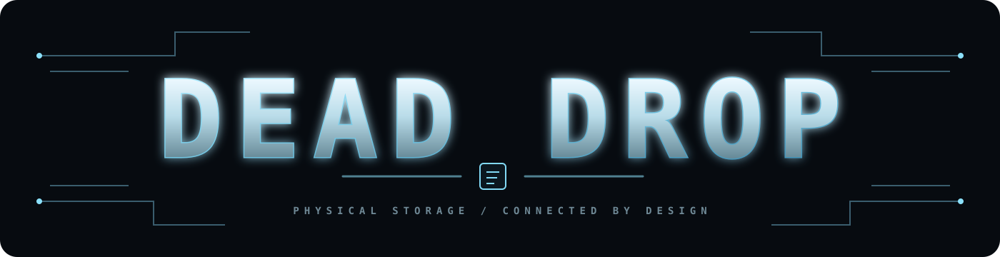
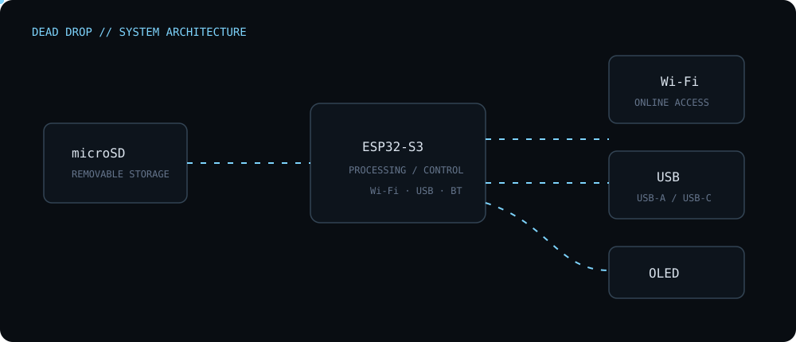
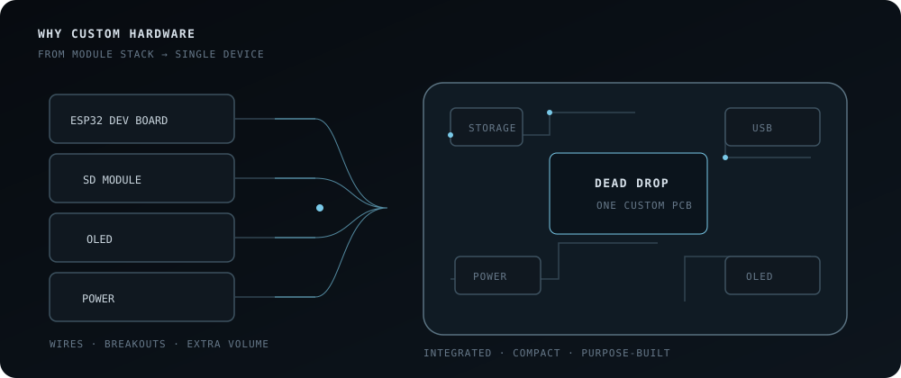
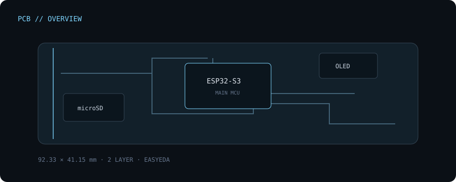
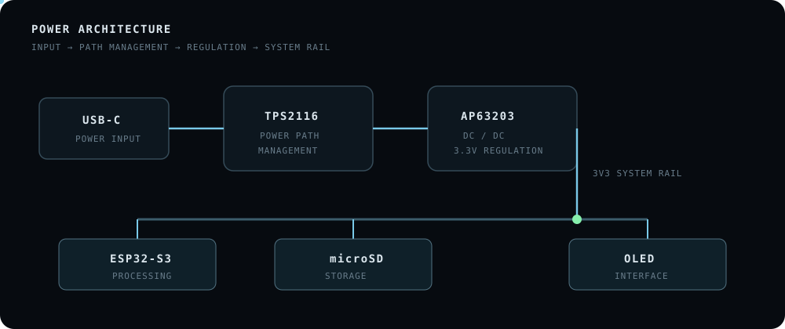
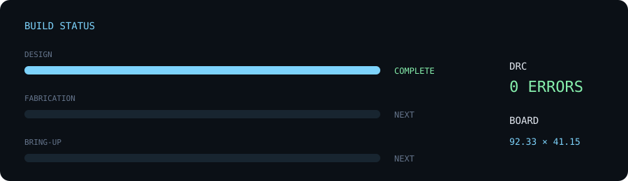
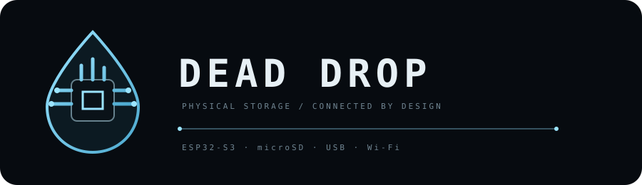

<p align="center">
  
</p>

### Physical storage. Online, without the friction.

<p align="center">
  
</p>

<p align="center">
  <strong>A compact ESP32-S3 based storage device designed to make physical storage feel like an online service.</strong>
</p>


<p align="center">
  
  
  
  
  
</p>

---

## 01 — THE DEVICE

**Dead Drop** is a custom portable storage device built around an **ESP32-S3** and removable microSD storage.

The idea is simple:

> **Take something as physical and inconvenient as removable storage and give it the convenience of an online-first workflow.**

Storage, wireless connectivity, USB, local feedback and power management are integrated onto a single custom PCB.

No development-board stack.

No collection of breakout modules.

**One board. One device.**

<p align="center">
  
</p>

---

## 02 — THE HARDWARE

<p align="center">
  
</p>

The current board is built around a compact, connector-driven layout:


### Core hardware

| | |
|---|---|
| **MCU** | ESP32-S3-WROOM-1-N16R8 |
| **Storage** | Removable microSD |
| **Display** | 128×32 OLED |
| **Wireless** | Wi-Fi + Bluetooth |
| **USB** | USB-A + USB-C |
| **Power** | TPS2116DRLR + AP63203QWU-7 |
| **PCB** | 2-layer FR-4 |
| **Dimensions** | 58.67 × 35.96 mm |

---

## 03 — WHY CUSTOM?

A prototype can be built from development boards:

<p align="center">
  
</p>


That works.

But Dead Drop is intended to be an actual device rather than a collection of development modules.

The new PCB brings the major systems onto one board:

```text
                 DEAD DROP

      ┌──────────────────────────┐
      │                          │
      │      STORAGE             │
      │          │               │
      │      PROCESSING          │
      │          │               │
      │       POWER              │
      │          │               │
      │     CONNECTIVITY         │
      │                          │
      └──────────────────────────┘
```

The goal isn't simply making a smaller prototype.

It's **owning the hardware.**

---

## 04 — PCB

Designed from scratch in **EasyEDA**.

<p align="center">
  
</p>

### Current board layout

The PCB is arranged around the actual physical interfaces of the device:

- **USB-A** — left side
- **USB-C** — right side
- **OLED** — upper section
- **microSD** — accessible from the upper edge
- **ESP32-S3** — central lower section
- **Power circuitry** — distributed around the input/regulation area
- **Tactile switch** — direct physical input
- **Antenna** — kept clear at the lower edge of the ESP32 module

The board uses:

```text
2-LAYER PCB
FR-4
1.6 mm
1 oz COPPER
BLACK SOLDER MASK
WHITE SILKSCREEN
```

**DRC — 0 REPORTED ERRORS**

---

## 05 — POWER

Power management is integrated directly into the PCB.

<p align="center">
  
</p>

The power subsystem uses:

- **TPS2116DRLR** — power-path management
- **AP63203QWU-7** — DC-DC conversion
- **3.3 µH inductor**
- dedicated decoupling

The power circuitry is kept close to the relevant input and regulation paths instead of being implemented as a separate module.

---

## 06 — SYSTEM

At the center of the device is the **ESP32-S3-WROOM-1-N16R8**.

It provides:

- processing
- Wi-Fi
- Bluetooth capabilities
- USB functionality
- communication with the microSD subsystem
- communication with the OLED

The **microSD interface** provides removable local storage.

The **OLED** provides local device feedback.

The **USB-A and USB-C connectors** provide physical connectivity and power access.

---

## 07 — PCB DESIGN

The PCB design went through the complete hardware workflow:

<p align="center">
  
</p>

The design process included:

- schematic
- component selection
- PCB placement
- power routing
- signal routing
- ground / return paths
- board outline
- silkscreen and branding
- DRC verification
- Gerber generation
- BOM generation
- CPL generation

The final design reached:

**DRC — 0 REPORTED ERRORS**

---

## 08 — DESIGN PHILOSOPHY

### SMALL

The board is designed around the physical constraints of a portable storage device.

The connectors, display, storage, ESP32-S3 and power system are placed directly around the intended physical interaction points.

### INTEGRATED

The project moves away from development-board stacks and brings the required circuitry onto one PCB.

### DELIBERATE

Connector placement, component placement, routing, board geometry and antenna clearance are treated as part of the product design.

The PCB isn't just where the circuit lives.

**It is part of the device.**

---

## 09 — MANUFACTURING

The repository contains the manufacturing output required to move the design toward fabrication:

```text
manufacturing/
├── gerbers/
├── bom/
└── cpl/
```

The current workflow is:

```text
DESIGN
  ↓
DRC
  ↓
GERBERS
  ↓
FABRICATION
  ↓
PCBA
  ↓
HARDWARE BRING-UP
```

The PCB design and manufacturing data are prepared.

Physical fabrication and assembly are the next stage.

---

## 10 — STATUS

```text
SCHEMATIC             DONE
COMPONENT SELECTION   DONE
PCB LAYOUT            DONE
ROUTING               DONE
BOARD OUTLINE         DONE
SILKSCREEN            DONE
DRC                   0 ERRORS
GERBERS               DONE
BOM                   DONE
CPL                   DONE

PCB FABRICATION       NEXT
PCBA                  NEXT
HARDWARE BRING-UP     NEXT
FIRMWARE              NEXT
ENCLOSURE             NEXT
```

---

## 11 — REPOSITORY

```text
dead-drop/
│
├── hardware/
│   ├── schematic/
│   ├── pcb/
│   └── libraries/
│
├── manufacturing/
│   ├── gerbers/
│   ├── bom/
│   └── cpl/
│
├── assets/
│   ├── 3d.gif
│   ├── dead-drop-render.png
│   ├── boot.svg
│   ├── architecture.svg
│   ├── pcb-scan.svg
│   ├── power-flow.svg
│   └── pipeline.svg
│
└── README.md
```

---

## 12 — WHAT'S NEXT

The PCB is only the first half of Dead Drop.

```text
CUSTOM PCB
     │
     ▼
FABRICATION
     │
     ▼
   PCBA
     │
     ▼
HARDWARE BRING-UP
     │
     ▼
 FIRMWARE
     │
     ▼
 ENCLOSURE
     │
     ▼
FINISHED DEVICE
```

Planned work:

- ESP32-S3 firmware
- storage management
- wireless file access
- OLED interface
- USB functionality
- data transfer workflows
- enclosure design
- hardware testing
- power optimization

---

<p align="center">
  
</p>

<p align="center">
  <strong>NOT ANOTHER DEVELOPMENT BOARD.</strong>
</p>

<p align="center">
  <sub>A storage device built like a product.</sub>
</p>

<p align="center">
  <sub>Physical in your hand. Online when you need it.</sub>
</p>

<p align="center">
  Built by <strong>Aarush Sharma</strong>
</p>
